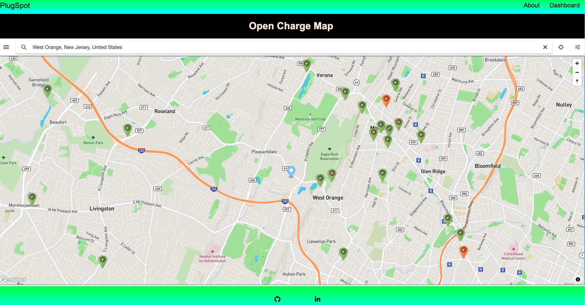

# PlugSpot - EV Charging Station Locator

## Table of Contents
* [Description](#description)
* [Preview](#preview)
* [Installation](#installation)
* [Questions](#questions)

## Description

PlugSpot is a web application built to help the community of electric vehicle owners. Get started by navigating the Dashboard and enter a city anywhere around the world! It uses the Open Charge Map API that allows users to search the name of any city and locate charging stations in and around that area.

## Preview

The following image shows a mock-up of the generated HTML’s appearance and functionality:

 
GitHub Pages - ()

## Installation 
The user should clone the repository from GitHub and then install Node. The user should then run npm start to run the program.   

## Questions
Please email me at carl.logerie92@gmail.com with any questions.

